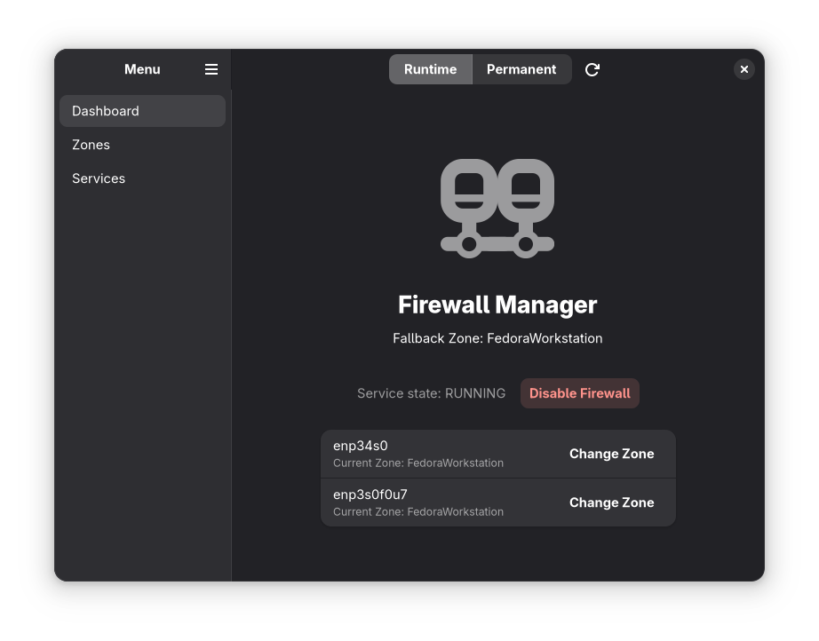

<h1 align="center">Firewall Manager</h1>

<p align="center">
  A modern, GNOME-integrated GUI for managing firewalld.
</p>

## Overview

Firewall Manager provides a clean and intuitive interface for configuring `firewalld`. Built with Rust and GTK4/libadwaita, it integrates seamlessly with the GNOME desktop environment, allowing users to effortlessly manage network zones, define custom services, and toggle runtime versus permanent firewall rules.

<p align="center">
  
</p>

## Features

- **Runtime vs Permanent Modes:** Effortlessly toggle between validating temporary configurations and persisting those settings to disk.
- **Contextual Change Tracking:** A smart UI that tracks unsaved runtime modifications, ensuring you never accidentally lose or permanently apply rules without a prompt.
- **Zone Assignments:** Quickly view and switch active zones for your network interfaces.
- **Service Definitions:** Define, edit, and apply custom service profiles (ports and protocols) without dropping into the CLI.

## Installation

### Building from Source

To build and install the project locally using Flatpak, ensure you have `flatpak` and `flatpak-builder` installed, along with the standard GNOME 48 SDK.

```bash
# Clone the repository
git clone https://github.com/rodrigofilipefaria/FirewallManager.git
cd FirewallManager

# Build and install the Flatpak package
flatpak-builder build-dir com.github.rodrigofilipefaria.FirewallManager.json --force-clean
flatpak-builder --user --install --force-clean build-dir com.github.rodrigofilipefaria.FirewallManager.json

# Run the application
flatpak run com.github.rodrigofilipefaria.FirewallManager
```

## Requirements

If running or compiling natively outside of a Flatpak container, your system will require:
- **Rust toolchain** (cargo, rustc)
- **GTK4 / libadwaita** development headers
- **firewalld** (must be active and serving its D-Bus endpoint)

## License

This project is licensed under the GPL-3.0 License. See the [COPYING](COPYING) file for full historical details.
